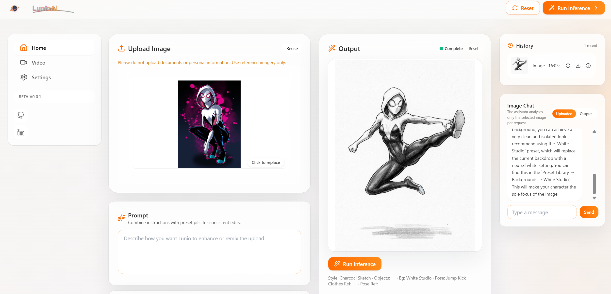

<div align="center">

  

  <br/>

  

</div>

# Lunio Glass

An AI-assisted image editing and generation experience. The app pairs a Vite + React + Tailwind frontend with a lightweight Express API to orchestrate image inference, presets, and history. It is designed for fast iteration, clear UX, and safe operations across local and cloud environments.

## What It Does
- Upload a reference image and describe your intent in a prompt.
- Combine instructions with preset “pills” for consistent edits.
- Run inference and review results side-by-side with the source.
- Keep a bounded history of recent generations for quick reuse.
- Chat assistant provides contextual tips based on the active image.

## Current Features
- Image upload with preview and replacement flow.
- Preset library (backgrounds, styles, objects, poses) and prompt composer.
- Inference controls surfaced in a clean, glass-style layout.
- Result panel with metadata snippet and one-click re-run.
- History panel capped to recent items for performance.
- API proxy persisting generated assets under `backend/storage/` (git-ignored).

## Coming Soon
- Multi-image references and better mask/control support.
- Batch runs and queue progress indicators.
- Video modes with frame-aware presets.
- Project collections and shareable links.
- Test suites: Vitest (frontend) and Jest/Supertest (backend).

## Tech Stack
- Frontend: Vite, React, Tailwind CSS.
- Backend: Node.js, Express, async/await services, filesystem helpers.
- Tooling: npm scripts, Nodemon, ESLint/Prettier, Docker.

## **Soon* Local Development
- Install: `cd frontend && npm install && cd ../backend && npm install`.
- Run API: `cd backend && npm run dev` (port `4000`).
- Run UI: `cd frontend && npm run dev` (Vite proxies `/api`).
- Build UI: `cd frontend && npm run build && npm run preview`.
- Start API (prod): `cd backend && npm run start`.

Environment files are expected locally and must never be committed. Do not place secrets in the repository; use `.env` and cloud secret stores.

## Architecture on GCP
- Backend on Cloud Run (containerized Express API).
- Frontend static bundle served via Cloud Storage and CDN or by the API container where appropriate.
- Global HTTPS Load Balancer for domain and caching.
- Secret Manager for API keys and sensitive config.
- Cloud Build for container builds and deployments.

The diagram above mirrors this layout at a high level without exposing identifiers.

## CI/CD
- Single `cloudbuild.yaml` drives builds for both staging and production.
- Branch-based triggers (e.g., `dev` → staging, `main` → production).
- Steps: build frontend → build/push image → deploy Cloud Run → sync static assets → optional CDN invalidation.
- Secrets injected from Secret Manager at deploy time.

## Useful GCP Commands (redacted placeholders)
Use placeholders and per-environment variables. Replace values in `<angle-brackets>`.

```bash
# Core project context
gcloud config set project <PROJECT_ID>
gcloud config set run/region <REGION>

# Enable required services
gcloud services enable run.googleapis.com cloudbuild.googleapis.com artifactregistry.googleapis.com secretmanager.googleapis.com compute.googleapis.com

# Artifact Registry for container images
gcloud artifacts repositories create <REPO_NAME> \
  --repository-format=docker \
  --location=<REGION>

# Build and submit with Cloud Build
gcloud builds submit --config=cloudbuild.yaml \
  --substitutions=_ENVIRONMENT=<staging|production>,_SERVICE_NAME=<SERVICE>,_BUCKET_NAME=<BUCKET>,_INVALIDATE_CDN=<true|false>

# Deploy to Cloud Run directly (alternative to Cloud Build step)
gcloud run deploy <SERVICE> \
  --image=<REGION>-docker.pkg.dev/<PROJECT_ID>/<REPO_NAME>/<IMAGE>:<TAG> \
  --allow-unauthenticated \
  --update-secrets=GEMINI_API_KEY=<SECRET_NAME>:latest

# Create and sync a static site bucket
gsutil mb -l <REGION> gs://<BUCKET>
gsutil -m rsync -d -r frontend/dist gs://<BUCKET>

# Optional: invalidate CDN cache behind a URL map
gcloud compute url-maps invalidate-cdn-cache <URL_MAP_NAME> \
  --path="/*"
```

## Repository Structure
```
frontend/   # Vite app (main surface: src/LunioAIApp.jsx)
backend/    # Express API exposing /api/* and persisting storage
support/    # Collaboration assets (screenshots, diagrams)
CHANGELOG.md
image-features.yaml
```

## Notes on Safety and Hygiene
- Do not upload documents or personal information. Use reference imagery only.
- Keep `.env` files local; never commit secrets.
- `backend/storage/` stays out of version control to prevent leaks.

---

Happy building! If you want, I can also wire basic tests and add run scripts to `frontend` and `backend` in a follow-up.

My LinkedIn: https://www.linkedin.com/in/juan-henrique-004a3b356/
